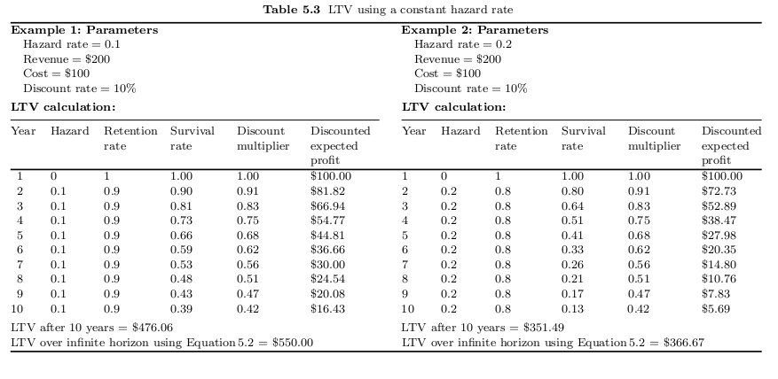
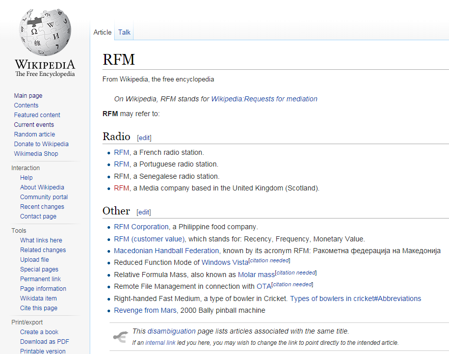
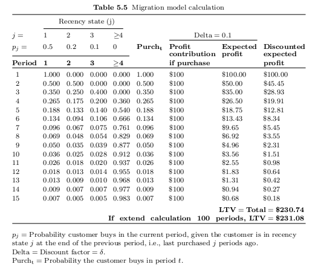
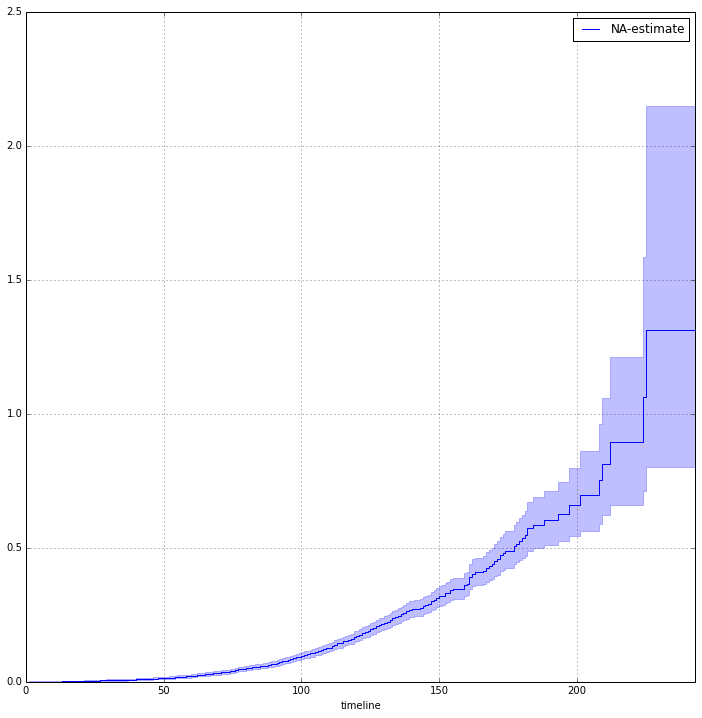
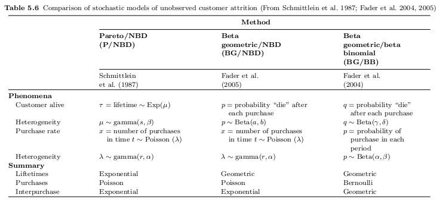
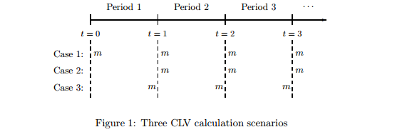
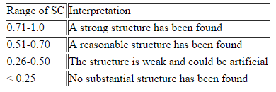

### Introduction

This paper aims to layout the current state of Customer Lifetime Value calculation research. It is entirely practical, so mathematical descriptions will only be discussed where they are important from a practical perspective. It also aims to provide both code and spreadsheets to allow for usage of the models discussed. None of the work shown and discussed here is original, I will point out references in the text but please also see the references listed in the bibliography for further details.

### List of Models:

##### Contractual

- Naive
- Recency Frequency Monetary (RFM) Summaries
- Markov Chains
- Hazard Functions
- Survival Regression
- Supervised Machine Learning using Random Forest

#### Non-Contractual

- Management Heuristics
- Distribution Based Approaches

#### CLV approaches

CLV research aims to model the net revenue that can be obtained from the behaviour of clients. Successfully answering this question allows for the reshaping of firm's activites to maximise the profit that can be gained via:

-Adjusting the marketing expenditure so it is not wasted on net-negative cohorts.

-Targeting marketing expenditure to avoid a client leaving (Churning).

-Targeting former clients to restart profitable relationships.

CLV models tend to be in two forms; contractual vs uncontractual. Contractual tends to be easier to deal with as there is certainty of the clients current status (Alive vs. Dead). We will look in this paper at contractual accounts before moving onto the more difficult extensions developed for non-contractual relationships.

#### Basic Equation

The general idea of Customer Lifetime Value is easily stated:

**"The net present value of the profits linked to a specific customer once the customer has been acquired, after subtracting incremental costs associated with marketing, selling, production and servicing over the customer's lifetime."** (Blattberg et al. 2008)

Formally this can be written as: 

$$
CLV = \sum\limits_{t=1}^\infty  \frac{E[\hat{V}_t]}{(1+\delta)^{t-1}}
$$

(Taken from Blattberg et al. 2008)

Where the $\hat{V}$ represents the customer's net profit to the firm and $\delta$ represents the discount rate at each time period.


A simple way of calculating this requires:

1. The probability of a client leaving in a given period. (t)
2. The discount multiplier of capital for the given period. (DR)
3. Expected Revenue per client.
4. Cost of relationship maintenance.

If point 1 (called "*A*"" below) is taken as stable throughout the lifespan it can be calculated for a given period as:

$$
\textbf{Survival Rate in Year t} = (1-A)^{t-1}
$$

Assuming a stationary discount rate (*DR*) we can calculate the discount rate for a given period it as:

$$
\textbf{Discount Multiplier} = 1/(1 + DR)^{t-1}
$$

This is trivial to produce in Excel and the output would look something like this:

# Model 1: Naive



(Taken from Blattberg et al. 2008 p.110)

So we will now move onto the practical points regarding the collection of the data that we need.

###### From Historical Data

The least sophisticated approach to working out a model life time would be to merely take the proportion who leave duration a duration (lets call it *A* for attrition) and treat it as constant and universal. This then can be plugged in to the LTV equations above with the discount rate. Next we would take the average spend by all customers under investigation and plug this into the above equation. We can then model the future!


1. Working with old data from the start point calculate the proportion of clients that stay in a given period. (Hazard Rate)
2. Calculate the average spend per client during this period. (Revenue)
3. Calculate the average cost of marketing expenditure per period per client. (Cost)
4. Obtain the Firms Discount Rate. (Discount Rate)

###### *"Everything changes and nothing stands still." (Heraclitus as quoted in Plato's "Cratylus")*

###### *"You are not a beautiful or unique snowflake." (Tyler Durden in "Fight Club" by Chuck Palahniuk)*

There are a number of problems that might arise with the above model largely to do with the fact that we are treating all clients the same and all portions of time the same. More specifically

1. The Hazard Rate is considered to steady. Is a client who has been with a company for < 1 period likely to have the same attrition rate as one who has been with a company for say 7? Even more alarming is that a steady Hazard Rate leads us to predictions of all clients (of a certain cohort) leaving by a certain period.
2. All clients are treated the same in terms of spending. There is no differentiation based on spending habits.
3. 1 & 2 can interact, so high spending clients might have a different Hazard Rate then lower spending clients.

So we will start off looking at simple solutions and move on to more ~~cool~~ sophisticated approaches that try to incorporate this heterogeneity.

# RFM

##### What is RFM?



RFM refers to a modelling technique that utilises Recency Frequency and Monetary (RFM) data from client records (Bult & Wansbeek 1995).

Generally it uses the below definitions:

- Recency: Period since last purchase.
- Frequency: How many purchases an individual made during the observation period.
- Monetary: Cumulative total spent by client during observation period.

Once we have manipulated this data into this form we can then group the data based on these metrics. There is no *a priori* correct way of doing this that holds for all data. We will follow the simple example of Birant (2011). Clients are split along each metric into quintiles (20% groupings) and assigned an ordinal label of 5 for the highest 20% of values, 4 to next highest etc. These are then concatenated (ex 454, 134, 555 etc) This allows for a quick short hand to group customers. So for example we can tell that a 155 is a frequent purchaser who has spent a lot of money during this period but has not purchased in some time. This may be a sign that the client is in danger of leaving.

This gives us an idea of how RFM can work to quickly segment clients. However it still seems too trivial for a lot of situations. Birant (2011) lays out a more sophisticated approach latter in the paper involving clustering of the post RFM groups. I actually think that clustering on the raw RFM data prior to the grouping makes more sense as there seems no a priori reason to assume that quintile splits is more useful then pure clustering. (See Appendix 3 at the end of this paper for an overview of some more basic Numerical Clustering). We can then take the assigned group and use this to create groupings that we can then use to predict future client activity.

One thing to note regarding RFM models is that the model requires at least 1 period of activity from a client, one possible way of extending the model to allow for more immediate assessment is to build a model based on the client traits that are known and use this to predict the RFM cluster that the client is likely to belong to. This would have to be tested empirically to know if there was sufficient data in this client information to see if first the predictions of correct cluster can be made accurately enough to be of use and secondly that the cluster assignment in turn provides a useful framework for prediction of future behaviour.

[Bruce Hardie](http://www.brucehardie.com/) a Professor at the London Business School has an Excel Spreadsheet and a paper on how to implement RFM Summaries [here](http://www.brucehardie.com/notes/022/).

# Migrating Models to the Markov Chains

##### *"Man is born free, and everywhere he is in chains" Rousseau (1762)*
##### *"The old endless chain of love, tolerance, indifference, aversion and disgust" Beckett (1938)*

An alternative way to look at CLV calculations is to treat the discrete time periods since last purchase as states. For each state we can then assign a probability that the client will make a purchase (P) based on the state that they are in (j). 1 - $P_j$ then becomes the probability that they will drop to the next state - in other words that they don't make a purchase. Below is an example of a state based model and CLV calculation taken from Blattberg (2008).



(Taken from Blattberg et al. 2008 p. 116)

##### Moving to Markov Chains

We can write this more formally as a Matrix. The benefits of this relate to the ability to calculate the infinite Life Time Value easily and also to reshape the expenditure of marketing budget based on states. We start by creating a *P* Matrix which shows the transition probabilities from one state to the next. A second Matrix *G* is created which shows the Profit of a purchase minus the marketing cost. Pfiefer & Carraway (2000) provide an example where the marketing budget is cut for all non-positive states net of marketing costs in order to increase a better return on a Marketing Budget.

# Hazard Function

One issue that must be noted is that of "censorship". Censorship is the fact that we have incomplete data when dealing with existing clients, we are unaware of when they will leave in the future. 


(Taken from Davidson-Pilon 2013)

The censorship issue is illustrated above as we don't at time *t* have any idea how long the blue lines will continue to . If we chose to leave these out of the modelling process we would be giving up possibly useful data. This example shows "Right-Censoring" however "Left-Censoring" where a customer is already existing for some unknown duration prior to the modelling period can also occur. This death event is taken to be final and known (in Markov Chain terminology it is an "Absorbing State").

Formally the hazard function can be written using the Nelson-Aalen estimator as:


$$
\hat{A}(t) = \sum\limits_{k=1}^K  \frac{\text{Number of individuals observed to fail at }t_k}{\text{Number of indidivudals at risk just prior to }t_k}
$$

(taken from Beyersmann et al. 2012 p.22)

An example hazard curve can be seen below, showing synthetic client data from a Churn Dataset.



We can also produce a probability for clients moving between time states to "die". (Taken from personal research [link](http://nbviewer.ipython.org/github/srepho/srepho.github.io/blob/master/Survival/sa.ipynb))


These analysis are quite simple to perform. Effectively we just need the dataset to contain the age of a customers account and the point at which they closed the account (if they did). Fitting the Nelson-Aalen estimator shown above once this dataset is loaded can be completed in Python as follows:

```{r eval=FALSE}
from lifelines import NelsonAalenFitter
naf = NelsonAalenFitter()
naf.fit(T,event_observed=C)
```

In R it is completed as follows:

```{r eval=FALSE}
library(mvna)
model <- mvna(data, state.names, tra, cens.name)
```

It is also possible to fit difference estimators based on groupings of the data. For example we could build a separate hazard function for each clustering group. This is fine for small groupings, however it is usually better to use Survival Regression techniques before splitting into too many groups.

#### From One to Many

In the above discussion we looked at just time until "death". In fact we can extend the Nelson-Aalen estimator to handle multiple outcomes. I will just show the math below as I am not too familiar with its usage.

$$
\hat{A_{0j}}(t) = \sum\limits_{k=1}^K  \frac{\text{Number of observed type j events at }t_k}{\text{Number of indidivudals at risk just prior to }t_k}
$$

(taken from Beyersmann et al. 2012 p.25)

Furthermore we can also look at movement between these states again with the Nelson-Aalen estimator.

$$
\hat{A_{lj}}(t) = \sum\limits_{k=1}^K  \frac{\text{Number of l}  \rightarrow \text{j trainsitions at }t_k}{\text{Number of indidivudals at risk in state l just prior to }t_k}
$$

(taken from Beyersmann et al. 2012 p.25)

# Survival Regression

It is also possible to utilise data about the customer directly into our analysis through Survival Regression. Due to censorship we cannot directly use normal linear regression. The most famous approach is the Cox Proportional Hazard Model. Below is an example from Python (lifelines Package). The dataset relates to Criminal Recidivism and can be found [here](http://cran.r-project.org/doc/contrib/Fox-Companion/Rossi.txt)

From Python:

```{r eval=FALSE}
from lifelines.datasets import generate_rossi_dataset
from lifelines import CoxPHFitter

rossi_dataset = generate_rossi_dataset()
cf = CoxPHFitter(alpha=0.95, tie_method='Efron')
cf.fit(rossi_dataset, duration_col='week', event_col='arrest')

print cf.summary()
```


From R:

```{r cache=TRUE, cache.path = 'PGi_cache/', fig.path='figure/', message=FALSE}
library(survival)
Rossi <- read.table("D:/Users/soates/Documents/Github/srepho.github.io/CLV/Rossi.txt", header=T)
mod.allison <- coxph(Surv(week, arrest) ~ fin + age + race + wexp + mar + paro + prio, data=Rossi)
mod.allison
```


In terms of working out which predictors to use we would go back and forth between.

1. Looking at the p values.
2. Looking at the total model fit via the C-Index (Concordance Indesx)

This is because we cannot use conventional loss functions due to the time component. The Concordance Index which assess the ordering of survival times between a model and the actual event.

In R we can see this via:

```{r cache=TRUE, cache.path = 'PGi_cache/', fig.path='figure/', message=FALSE}
survConcordance(Surv(week, arrest) ~predict(mod.allison), Rossi)
```

*lifelines in Python has a similair function*.

The Concordance Index uses the same scale as the Area Under the Curve (AUC) so random guessing will obtain 0.5, 1.0 is perfect prediction (or concordance) and 0.0 is perfect anti-concordance.

In summary we can use the predictions from Survival Analysis based techniques to feed into our predictions of a clients probability of leaving the company to more accuratly predict based on heterogenaity.

# Machine Learning

### Heading into the [Random] Forest


It is possible to treat the probability of a client leaving as a straightforward supervised classification Machine Learning problem. This technique is less suitable where the number of discrete points at which a client can leave is more then a small number. In those cases we would use the Survival Analysis techniques mentioned above. The below example is taken from a previous blog post I [wrote](http://srepho.github.io/Churn/Churn) so I won't go into all that is going on here. It relates to a synthetic dataset and we are merely trying to predict the binary "Churn"/"No Churn" variable. Note the splitting of the dataset and the cross-validation steps allow for very accurate predictions for how such an algorithm would work in production. I have limited the below to a single algorithm (Random Forest which is [itself](http://en.wikipedia.org/wiki/Random_forest) an ensemble of weak learning algorithms). Accuracy could be boosted by running many different types of algorithms on the data and "stacking" the predictions. An interactive visualisation of one way of assessing algorithm similarity can be seen [here](http://topepo.github.io/caret/similarity.html). The dataset being used is very unbalanced (the vast majority of customers do not churn) so the [Kappa](http://en.wikipedia.org/wiki/Cohen&#39;s_kappa) . I have also used adaptive sampling to avoid a brute force search through the parameter space (RF has number of "trees" to grow and number of variables to sample as parameters). Parameter search can be sped up via two main approaches:

1. Spread the algorithm (if possible) over multiple cores.
2. Use a faster algorithm or implementation.

Sadly in R 1. is only possible on Unix based machines. R itself can be a very slow language once data starts to get bigger so 2. often means using another language (Python is often faster and can use multiple cores on Windows). For really large data we reduce the complexity of the algorithm and look to faster ML programs ([Vowpal Wabbit](http://hunch.net/~vw/) and [BIDMach](http://bid2.berkeley.edu/bid-data-project/) have both been used very successfully in Machine Learning competitions). It is important to note though that it is very cheap to buy a large instance on AWS which can ameliorate a lot of these problems. *At the time of writing an R3 Instance containing 32 cores and 244 GB of RAM costs AU$0.32 an hour on the spot market.*

**As was stated at a recent Machine Learning conference, "There are only a tiny number of companies that have greater then 244GB of interesting data".**


```{r cache=TRUE, cache.path = 'PGi_cache/', fig.path='figure/', message=FALSE}
library(plyr)
library(dplyr)
library(stringr)
library(ggplot2)
library(reshape2)
library(caret)
#churn <- read.csv("D:/Users/soates/Downloads/churn.txt", header=T)
churn <- read.csv("D:/Users/soates/Documents/Github/srepho.github.io/CLV/churn.txt", header=T)
set.seed(12)
trainIndex <- caret::createDataPartition(churn$Churn., p = .75, list = FALSE, times = 1)
churnTrain <- churn[ trainIndex,]
churnTest <- churn[-trainIndex, ]
churnTrain$Phone<-NULL
churnTest$Phone<-NULL
churnTrain$Area.Code<-as.factor(churnTrain$Area.Code)
churnTest$Area.Code<-as.factor(churnTest$Area.Code)
set.seed(12)
rfmodel<-train(churnTrain$Churn.~., data=churnTrain, method="rf", trainControl = c(method = "adaptive_cv", number = 10, repeats = 5, classProbs = TRUE, summaryFunction = twoClassSummary, adaptive = list(min = 10, alpha = 0.05, method = "gls", complete = TRUE)), metric="Kappa")
pred<-predict(rfmodel, newdata=churnTest)
confusionMatrix(pred, churnTest$Churn.)
```

Predictions about the client's liklihood of leaving can then be fed back into other models or used directly on marketing decisions to try and encourage clients in danger to stay. One could model the purchases along the same lines. 


# But what of non-contractual situations?

In some commercial relationships it is not definitively possible to know if a client has stopped using the service. Accounts may lay dormant but always maintain a chance of springing back into life.


Some of the previously discussed models can be made to work in at least some of these cases (in particular Markov Chains). A lot of work has gone into handling this uncertainty of client state problem more directly. It has lead to a whole branch of specialist literature. We will list below some of these approaches.

# The ~~Customer~~ Manager is always right

One iconoclastic paper (Wubben & Wangenheim 2008) compared basic rules of thumb from executives and managers to more complex models (Pareto/NBD and BG/NBD which are discussed in the next section). The rules of thumb were very basic:

*If client has not purchased in x Months then they will not repurchase.*

(X was 3 Quarters for an Airline, 9 Months for an Apparel retailer, 6 Months for a CD seller).

However in almost all cases the "rules of thumb" based on managerial experience were superior to the more sophisticated approaches. They propose that these heuristics are so effective because the decisions are made with clear feedback (a requirement for the development of good human pattern recognition) and the assumptions of the more complex methods are often unrealistic. More recently Huang (2011) has used synthetically generated data for customer prioritisation to explore the failure of the more complex models more mathematically. Of particular note:

1. We are not usually able to identify the future top X% of customers even if we know the exact data generation process.
2. Even if the model maps the distribution of the data generation process a simple heuristic is just as effective.

Huang goes on to provide the following guidelines for when to use the more advanced models:

*"It is found that the performance of Pareto/NBD has a higher predictive accuracy when the proportion of historically active customers (known as the 'penetration') is smaller, the average historical frequency (called the 'frequency') is higher, the variance of such a frequency (called the 'variance') is lower, and the degree of concentration of such a frequency among historically active customers (called the 'concentration') is higher. The performance of the simple heuristic shows that,
except for the variance, the explanatory variables matter again. Furthermore, the results from Eq. (3) show that the 
Pareto/NBD model produces better predictions than the simple heuristic as to who the future premium customers will be when the penetration and variance are lower, and the frequency and concentration are higher. In other words, the heuristic tends to outperform the model for customer bases with a high penetration, low average frequency, high variance, and low concentration - a direct answer to the question, 'when would the heuristic work'."* 

(Huang 2011 p.502)

From a practical point of view the lesson is that we should include Management heuristics in our suite of models and compare it statistically to other more "sophisticated" approaches.

# Pareto and friends
Most of the more sophisticated approaches to modelling CLV in non-contractual settings treat as two separate problems:

1. The prediction of "Alive" or "Dead"
2. The probability of purchase/s

Starting with Ehrenberg (1959) a lot of literature centers around fitting distributions to these two questions. Ehrenberg proposed a Negative Binomial Distribution (NBD) but most modern approaches use two separate families of distributions, one for probability of being alive and the other for probability of purchases. A range of distributions have been use; the Pareto/NBD model of Schmittlein et al (1987), the Beta-Geometric(BG)/NBD of Fader, Hardie & Lee (2005), the Central Variant of the Beta-Geometric (CBG)/NBD and CBG/CNBD-k based on Platzer (2008).

One useful analogy (taken from Medri 2012) to understand these approaches is to imagine each customer as having two separate coins one that they flip to "decide" to answer 1. and the other for 2. (if applicable). The job of the data analyst is to predict these probabilities by finding the distribution parameters.


The above papers fit the named distribution parameters for each customer individually (though they could be used on cohorts) and then its a simple case of solving to find the maximum likelihood [MLE](http://en.wikipedia.org/wiki/Maximum_likelihood). The important point is that we need to check if that the assumptions of the modelling distributions are being met (see appendix for a discussion of this).




(Taken from Blattberg 2008 p.123)

The glaring weakness from the early papers that continues through to the more modern extensions is that there is no mechanism for the interplay between purchases and whether client is alive. Blattberg proposes the use of hierarchical Bayesian modelling to answer this question. We also need to be careful of individual level approaches that are relying on small amounts of information as they are likely to be noisy.

#### Implementation

##### Excel

One of the great things about even these more sophisticated methods is that they are possible in Excel. This allows access to them to those who are less comfortable with statistical programming. [Bruce Hardie](http://www.brucehardie.com/notes/) has a number of excel spreadsheets and excel walkthroughs of many of these models available. I will therefore just list some of them here:

-[BG/NBD Model](http://www.brucehardie.com/notes/004/)

-[BG/BB Model](http://www.brucehardie.com/notes/010/)

-[Pareto/NBD Model](http://www.brucehardie.com/notes/011/)

There is much else of value on his website.

##### R

R has a package called [BTYD](http://cran.r-project.org/web/packages/BTYD/index.html) (Buy Till You Die) that implements many of these models. We will walk through the implementation of a Pareto/NBD model from the [vignette](http://cran.r-project.org/web/packages/BTYD/vignettes/BTYD-walkthrough.pdf)

```{r cache=TRUE, cache.path = 'PGi_cache/', fig.path='figure/', message=FALSE}
library(BTYD)

cdnowElog <- system.file("data/cdnowElog.csv", package = "BTYD")
elog <- dc.ReadLines(cdnowElog, cust.idx = 2, date.idx = 3, sales.idx = 5)
elog$date <- as.Date(elog$date, "%Y%m%d")
elog <- dc.MergeTransactionsOnSameDate(elog)
end.of.cal.period <- as.Date("1997-09-30")
elog.cal <- elog[which(elog$date <= end.of.cal.period), ]
split.data <- dc.SplitUpElogForRepeatTrans(elog.cal)
clean.elog <- split.data$repeat.trans.elog
freq.cbt <- dc.CreateFreqCBT(clean.elog)
tot.cbt <- dc.CreateFreqCBT(elog)
cal.cbt <- dc.MergeCustomers(tot.cbt, freq.cbt)
birth.periods <- split.data$cust.data$birth.per
last.dates <- split.data$cust.data$last.date
cal.cbs.dates <- data.frame(birth.periods, last.dates, end.of.cal.period)
cal.cbs <- dc.BuildCBSFromCBTAndDates(cal.cbt, cal.cbs.dates, per="week")
params <- pnbd.EstimateParameters(cal.cbs)
params
LL <- pnbd.cbs.LL(params, cal.cbs)
LL
p.matrix <- c(params, LL)
for (i in 1:2){
  params <- pnbd.EstimateParameters(cal.cbs, params)
  LL <- pnbd.cbs.LL(params, cal.cbs)
  p.matrix.row <- c(params, LL)
  p.matrix <- rbind(p.matrix, p.matrix.row)
}
colnames(p.matrix) <- c("r", "alpha", "s", "beta", "LL")
rownames(p.matrix) <- 1:3
p.matrix

#Individual Estimates
pnbd.Expectation(params, t=52)
cal.cbs["1516",]
x <- cal.cbs["1516", "x"]
t.x <- cal.cbs["1516", "t.x"]
T.cal <- cal.cbs["1516", "T.cal"]
pnbd.ConditionalExpectedTransactions(params, T.star = 52, x, t.x, T.cal)
pnbd.PAlive(params, x, t.x, T.cal)

pnbd.PlotFrequencyInCalibration(params, cal.cbs, 7)

elog <- dc.SplitUpElogForRepeatTrans(elog)$repeat.trans.elog;
x.star <- rep(0, nrow(cal.cbs));
cal.cbs <- cbind(cal.cbs, x.star);
elog.custs <- elog$cust;
for (i in 1:nrow(cal.cbs)){
  current.cust <- rownames(cal.cbs)[i]
  tot.cust.trans <- length(which(elog.custs == current.cust))
  cal.trans <- cal.cbs[i, "x"]
  cal.cbs[i, "x.star"] <- tot.cust.trans - cal.trans
}
cal.cbs[1:3,]

T.star <- 39 # length of the holdout period
censor <- 7 # This censor serves the same purpose described above
x.star <- cal.cbs[,"x.star"]
comp <- pnbd.PlotFreqVsConditionalExpectedFrequency(params, T.star, cal.cbs, x.star, censor)
rownames(comp) <- c("act", "exp", "bin")
comp

tot.cbt <- dc.CreateFreqCBT(elog)
# ...Completed Freq CBT
d.track.data <- rep(0, 7 * 78)
origin <- as.Date("1997-01-01")
for (i in colnames(tot.cbt)){
  date.index <- difftime(as.Date(i), origin) + 1;
  d.track.data[date.index] <- sum(tot.cbt[,i]);
}
w.track.data <- rep(0, 78)
for (j in 1:78){
  w.track.data[j] <- sum(d.track.data[(j*7-6):(j*7)])
}

T.cal <- cal.cbs[,"T.cal"]
T.tot <- 78
n.periods.final <- 78
inc.tracking <- pnbd.PlotTrackingInc(params, T.cal,
                                     T.tot, w.track.data,
                                     n.periods.final)
inc.tracking[,20:25]


cum.tracking.data <- cumsum(w.track.data)
cum.tracking <- pnbd.PlotTrackingCum(params, T.cal,
                                     T.tot, cum.tracking.data,
                                     n.periods.final)

cum.tracking[,20:25]


```

[Michael Platzer](https://github.com/mplatzer/BTYDplus) has created a package that extends the BTYD package. It covers more sophisticated and recent variants of this type of modelling approach. It only appears to run on Unix based machines. His [Masters Thesis](https://e6c4d5dd-a-62cb3a1a-s-sites.googlegroups.com/site/michaelplatzer/stochastic-models-of-noncontractual-consumer-relationships/StochasticModelsofNoncontractualConsumerRelationships.pdf) covers a CLV competition and looks closely at improving the assumptions of some of the models discussed above. It also includes his own model (which is implemented in his R package) CBG/CNBD-k which takes the central variant approach but uses an [Erlang-k](http://en.wikipedia.org/wiki/Erlang_distribution) distribution to more accurately fit the model. His approach placed 2nd in the Direct Marketing Educational Foundation CLV 2008 competition.


# Appendicies:

### Appendix 1: Differences in CLV models

##### Important points regarding the CLV calculation:

Really what we are interested in is a way of assessing the future (residual) value of sets of customers.

For example Fader & Hardie (2012) work through 3 separate formulas:


1. from Blattberg et al (2008)

$$
CLV = \frac{m(1+d)}{1+d-r}
$$

2. from Capon (2007)

$$
CLV = \frac{mr}{1+d-r}
$$

3. from Ofek (2002)

$$
CLV = \frac{m}{1+d-r}
$$

These are all infinite geometric series:

$$
\sum\limits_{n=0}^\infty {k^{n}} = \frac{1}{1-k}, 0<k<1
$$

The difference is best summed up in the below diagram taken from Fader & Hardie (2012). The differences relate to whether the period is "booked" at the beginning or end of that period and whether the first period is "booked".



### Appendix 2: Assumptions of Distribution based Non-Contractual Models

Assumptions of the models (taken from Platzer 2008) are highlighted below.

##### NBD: 

1. When active number of transactions follows a Poisson Process with rate $\lambda$
2. The differences in $\lambda$ follows a Gamma distribution with shape *r* and rate $\alpha$

##### Pareto/NBD:

1. When active number of transactions follows a Poisson Process with rate $\lambda$
2. The differences in $\lambda$ follows a Gamma distribution with shape *r* and rate $\alpha$
3. Customer Lifespan exponentially distributed with death rate $/mu$
4. Differences in $\mu$
5. Purchasing rate and death rate are independently distributed

##### BG/NBD:

1. When active number of transactions follows a Poisson Process with rate $\lambda$
2. The differences in $\lambda$ follows a Gamma distribution with shape *r* and rate $\alpha$
3. After each purchase probability of death remains constant *p*
4. *p* follows a Beta distribution with parameters *a* and *b*
5. Purchase rate and death rate are independently distributed


##### CBG/NBD:
1. When active number of transactions follows a Poisson Process with rate $\lambda$
2. The differences in $\lambda$ follows a Gamma distribution with shape *r* and rate $\alpha$
3. At time zero and after each purchases probability of death remains constant *p*
4. *p* follows a Beta distribution with parameters *a* and *b*
5. Purchase rate and death rate are independently distributed

##### CGB/CNBD-k
1. While active number of transactions follows an *Erlang-k* distribution with rate $\lambda$
2. The differences in $\lambda$ follows a Gamma distribution with shape *r* and rate $\alpha$
3. At time zero and after each purchases probability of death remains constant *p*
4. *p* follows a Beta distribution with parameters *a* and *b*
5. Purchase rate and death rate are independently distributed
6. Observation period of each individual starts with a transaction at time zero

### Appendix 3: An overview of Clustering Numerical Values
#### A brief look at K-Means clustering

Birant (2011) looks to group the RFM as above and then run the data through a Clustering algorithm (in this case K-Means). Clustering algorithms are a form of *Unsupervised* Machine Learning, based on the fact that we do not provide a variable that needs to be predicted. The K-Means clustering algorithm attempts to group the data into k number of groups via the creation of centroids (group centers) and then iteratively moving them and recalculating the distance metrics. It will eventually converge to a least within cluster sum of squares. One downside is that we have to choose the number of clusters prior to running the algorithm, so it can be something of an art to nail down a useful number. (It is a useful number as there is no correct number of partitions in a strict mathematical sense). 


##### How Many Clusters?
One way of doing this is to project the clustered data to a lower number of dimensions (using say Principal Component Analysis) and then to plot it. A more sophisticated method is to utilise the Hartigan's Rule which states "It essentially compares the ratio of the within-cluster sum of squares for a clustering with *k* clusters and one with *k* + 1 clusters, accounting for the number of rows and clusters. If that number is greater than 10, then it is worth using *k* + 1 clusters." (Lander 2013) Another factor that is important for K-Means is that due to the random starting points of the centroids one should run it multiple times. Finally we need to scale our variables and exclude any that are not numeric. Finally K-Means can be affected by the ordering of variables so we should randomise them and rerun. Below we will use the well known [Iris Data Set](http://en.wikipedia.org/wiki/Iris_flower_data_set) just to show the Hartigan Rule output (Fisher 1936)

```{r cache=TRUE, cache.path = 'PGi_cache/', fig.path='figure/'}
library(cluster)
library(useful)
library(ggplot2)
data(iris)
#Lets have a quick look at the iris data set which has three species. We will just use the length variables.
qplot(Sepal.Length, Petal.Length, data = iris, color = Species)
iris_scaled<-scale(iris[, -ncol(iris)], center = TRUE, scale = TRUE)
hartiganResults <- FitKMeans(iris_scaled)
hartiganResults
PlotHartigan(hartiganResults)
```

The usual rule of thumb is to find the first point that meets Hartigan's metric so we would stop at 8 in the above dataset. (In fact this data set is the famous Iris Flower data set which contains three species - its a terrible dataset for cluster analysis!)

Another way of calculating the number of clusters is to use the "Gap Statistic" (Tibshirani, Walther & Hastie 2001). This statistic is calculated by "comparing the change in within-cluster dispersion with that expected under an appropriate reference null distribution" (taken from the Abstract of Tibshirani et al. 2001)

```{r cache=TRUE, cache.path = 'PGi_cache/', fig.path='figure/'}
gskmn <- clusGap(iris_scaled, FUN = kmeans, nstart = 50, K.max = 8, B = 500)
plot(gskmn)
gskmn
```

So we can see that we should use 2 factors, which is actually a pretty good guess as the plot shows that two of the species are partially intertwined (remember that cluster analysis has no idea of this fact).

##### From Means to Medioids
There is a related approach of the K-Means algorithm we can use known as *Partitioning Around Medoids* (PAM) or sometimes *K-Medoids* which can actually handle categorical data as well. It has some advantages over K-Means in terms of outliers and does not require a complete dataset.

```{r cache=TRUE, cache.path = 'PGi_cache/', fig.path='figure/'}
iris_4_PAM <- pam(iris_scaled, k=2, keep.diss = TRUE, keep.data = TRUE)
plot(iris_4_PAM)
```

A quick guide to the shadow plot and statistics (taken from [here](http://www.stat.berkeley.edu/~s133/Cluster2a.html))



Research has shown that Hartigan's Rule generally provides the best K estimate (Chiang & Mirkin, 2009)

#### Appendix 4: Markov Chains
(The following is taken from Blattberg (2008) which is itself adapted from Pfeifer & Carraway (2000). )


For simplicity we assume that there is 3 Recency States. The following matrix shows the probability of moving from one state to another.


$$
  P = \textrm{ State at t}
  \stackrel{\mbox{State at t + 1}}{
    \begin{bmatrix}
      p_1 & 1 - p_1 & 0\\
      p_2 & 0 & 1 - p_2\\
      p_3 & 0 & 1-p_3\\
    \end{bmatrix}}
$$

We can then create a matrix showing the profit from each state. In this case we presume that we only get money if they spend something. R is the revenue produced by the purchase and M is the Marketing cost spent on the client.

$$
G = \
\left[ {\begin{array}{cc}
R & -M \\
-M &  \\
-M &  \\
\end{array} } \right]
\
$$

Once we know the discount rate we can therefore generalise for any period (T) via 

$P^TG/(1+d)^T$ 

Therefore the entire (until the infinite period) Net Present Value (NPV) is simply:

$$
V^\infty \lim_{T\to\infty}V^T=[\mathbb{I}-(1+d)^{-1}P]^{-1}G
$$

Where $\mathbb{I}$ is the Identity Matrix.

# References

"Competing Risks and Multi-state Models with R" Beyersmann, Allignol & Schumacher (2012)

"Murphy" Beckett (1938)

"Data Mining Using RFM Analysis" Birant (2011) [link](http://cdn.intechweb.org/pdfs/13162.pdf)

"Database Marketing" Blattberg, Kim & Neslin (2008) Springer (International Series in Quantitative Marketing)

"Optimal selection for direct mail" Bult & Wansbeek (1995) Marketing Science

"Managing Marketing in the 21st Century" Capon (2007)

"Intelligent Choice of the Number of Clusters in K-Means Clustering: An Experimental Study with Different Cluster Spreads" Chiang & Mirkin (2009) Journal of Classification

"Estimating User Lifetimes - the right and many wrong ways" Davidson-Pilon (2013) [link](http://blog.yhathq.com/posts/estimating-user-lifetimes-with-pymc.html)

"Why should I be interested in Survival Analysis" Davidson-Pilon (2014) [webcast](www.dataorigami.net/screencasts)

"Estimating the Survival Function" Davidson-Pilon (2014) [webcast](www.dataorigami.net/screencasts)

"Estimating the Hazard Function" Davidson-Pilon (2014) [webcast](www.dataorigami.net/screencasts)

"Reconciling and Clarifying CLV Formulas" Fader & Hardie (2012) [link](http://www.brucehardie.com/notes/024/reconciling_clv_formulas.pdf)

"The use of multiple measurements in taxonomic problems" Fisher (1936) Annals of Eugenics

"'RFM and 'CLV': Using Iso-Value Curves for Customer Base Analysis" Hardie & Lee (2005) Journal of Marketing Research

"To model, or not to model: Forecasting for customer prioritization" Huang (2011) International Journal of Forecasting

"Applied Predictive Modelling" Kuhn & Johnson (2013)

"R for Everyone: Advanced Analytics and Graphics" Lander (2013)

"What's a customer worth: Case Study from Etsy" Medri (2012) presented at Strata Conference New York [link](http://cdn.oreillystatic.com/en/assets/1/event/85/Case%20Study_%20What_s%20a%20Customer%20Worth_%20Presentation.pdf)

"Customer Profitability and Lifetime Value" Ofek (2002)

"Modelling Customer Relationships as Markov Chains" Pfeifer& Carraway (2000) Journal of Interactive Marketing

"Stochastic models of non-contractual consumer relationships" Platzer (2008) Master of Science in Business Administration thesis [link](https://github.com/mplatzer/BTYDplus)

"The Social Contract" by Jean-Jacques Rousseau (1762)

"Estimating the number of clusters in a data set via the gap statistic" Tibshirani, Walther & Hastie (2001) Journal of the Royal Statistical Society

"Instant Customer Base Analysis: Managerial Heuristics Often 'Get It Right'" Wubben & Wangenheim (2008) Journal of Marketing

### Software

Allignol, A., Beyersmann, J. and Schumacher, M. (2008). mvna: An R Package for the Nelson-Aalen Estimator in
Multi-state Models R News, 8(2):48--50

Cam Davidson-Pilon "lifelines" (2013) [link](https://github.com/CamDavidsonPilon/lifelines)

Lukasz Dziurzynski, Edward Wadsworth and Daniel McCarthy (2014). BTYD:
Implementing Buy 'Til You Die Models. R package version 2.3.
http://CRAN.R-project.org/package=BTYD

John D. Hunter. Matplotlib: A 2D Graphics Environment, Computing in Science & Engineering, 9, 90-95 (2007), DOI:10.1109/MCSE.2007.55

Max Kuhn. Contributions from Jed Wing, Steve Weston, Andre Williams, Chris Keefer, Allan Engelhardt, Tony Cooper,
Zachary Mayer and the R Core Team (2014). caret: Classification and Regression Training. R package version 6.0-35.
http://CRAN.R-project.org/package=caret

Jared P. Lander (2014). useful: A collection of handy, useful functions. R
package version 1.1.8. http://CRAN.R-project.org/package=useful

A. Liaw and M. Wiener (2002). Classification and Regression by randomForest.
R News 2(3), 18--22.

Wes McKinney. Data Structures for Statistical Computing in Python, Proceedings of the 9th Python in Science Conference, 51-56 (2010)

Maechler, M., Rousseeuw, P., Struyf, A., Hubert, M., Hornik, K.(2014).
cluster: Cluster Analysis Basics and Extensions. R package version 1.15.3.

K. Jarrod Millman and Michael Aivazis. Python for Scientists and Engineers, Computing in Science & Engineering, 13, 9-12 (2011), DOI:10.1109/MCSE.2011.36

Jones E, Oliphant E, Peterson P, et al. SciPy: Open Source Scientific Tools for Python, 2001-, http://www.scipy.org/ [Online; accessed 2014-09-06].

Travis E. Oliphant. Python for Scientific Computing, Computing in Science & Engineering, 9, 10-20 (2007), DOI:10.1109/MCSE.2007.58

Patil, A., D. Huard and C.J. Fonnesbeck. 2010. 
PyMC: Bayesian Stochastic Modelling in Python. Journal of Statistical 
Software, 35(4), pp. 1-81.

Fabian Pedregosa, Gaël Varoquaux, Alexandre Gramfort, Vincent Michel, Bertrand Thirion, Olivier Grisel, Mathieu Blondel, Peter Prettenhofer, Ron Weiss, Vincent Dubourg, Jake Vanderplas, Alexandre Passos, David Cournapeau, Matthieu Brucher, Matthieu Perrot, Édouard Duchesnay. Scikit-learn: Machine Learning in Python, Journal of Machine Learning Research, 12, 2825-2830 (2011) 

Fernando Pérez and Brian E. Granger. IPython: A System for Interactive Scientific Computing, Computing in Science & Engineering, 9, 21-29 (2007), DOI:10.1109/MCSE.2007.53

R Core Team (2014). R: A language and environment for statistical computing. R Foundation for Statistical
Computing, Vienna, Austria. URL http://www.R-project.org/.

Therneau T (2014). _A Package for Survival Analysis in S_. R package version 2.37-7, <URL:
http://CRAN.R-project.org/package=survival>.

Stéfan van der Walt, S. Chris Colbert and Gaël Varoquaux. The NumPy Array: A Structure for Efficient Numerical Computation, Computing in Science & Engineering, 13, 22-30 (2011), DOI:10.1109/MCSE.2011.37

Hadley Wickham and Romain Francois (2014). dplyr: dplyr: a grammar of data
manipulation. R package version 0.2. http://CRAN.R-project.org/package=dplyr

H. Wickham. ggplot2: elegant graphics for data analysis. Springer New York,
2009.

Hadley Wickham (2011). The Split-Apply-Combine Strategy for Data Analysis.
Journal of Statistical Software, 40(1), 1-29. URL
http://www.jstatsoft.org/v40/i01/.

Hadley Wickham (2007). Reshaping Data with the reshape Package. Journal of
Statistical Software, 21(12), 1-20. URL http://www.jstatsoft.org/v21/i12/.

Hadley Wickham (2012). stringr: Make it easier to work with strings. R
package version 0.6.2. http://CRAN.R-project.org/package=stringr

Yihui Xie (2014). knitr: A general-purpose package for dynamic report
generation in R. R package version 1.6.