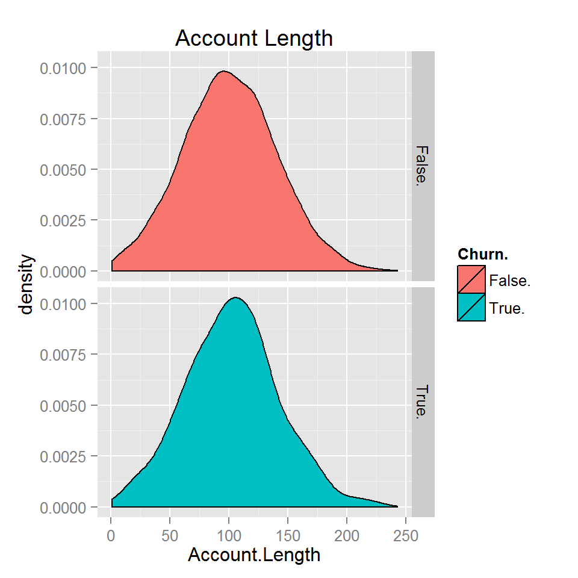
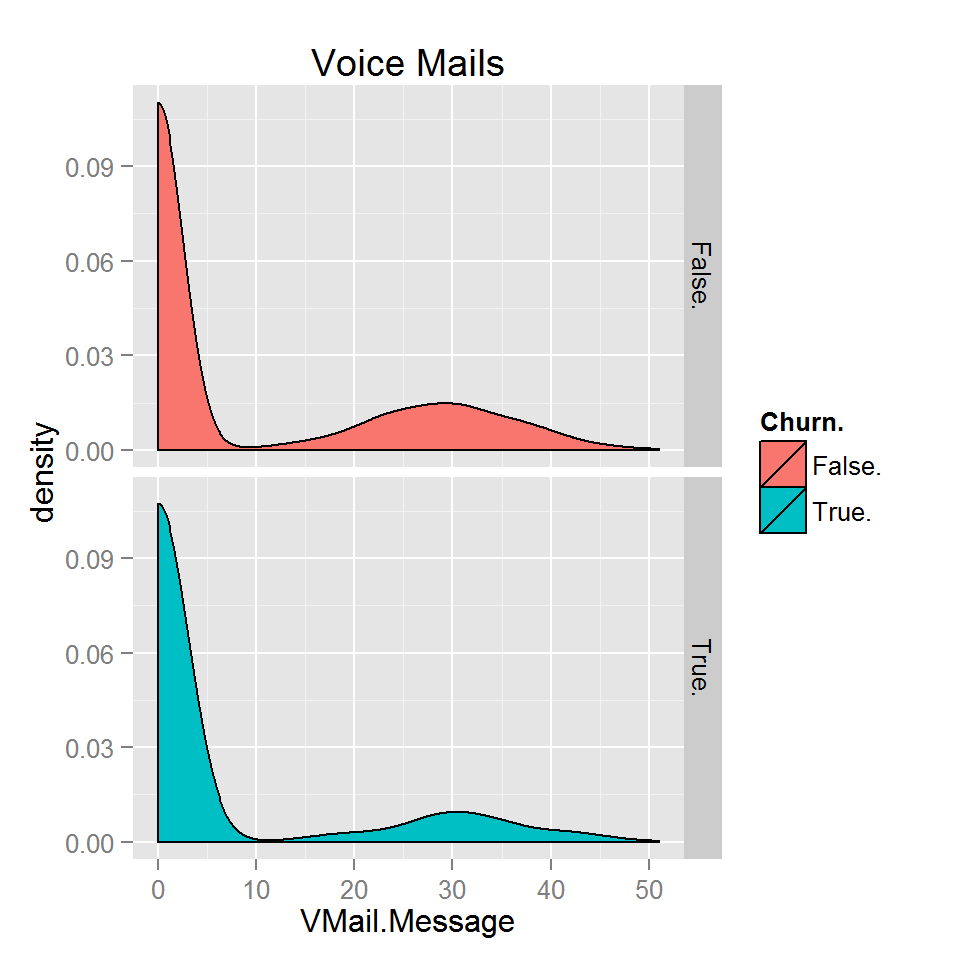

Churn Analysis
========================================================


### What We Are Trying To Do
One of the more common tasks in Business Analytics is to try and understand consumer behaviour. By understanding the hope is that a company can better change this behaviour. In many industries it is more expensive to find a new customer then to entice an existing one to stay. This is usually known as "churn" analysis. The aim is to accuratley identify the cohort who is likely to leave early enough so that the relationship can be saved.

### Data Set

This data is taken from a telecommunications company and involves customer data for a collection of customers who either stayed with the company or left wihtin a certain period. <i>In many industries its often not the case that the cut off is so binary. Frequently it might be more likely that a client account lays dormant rather then getting explicitly closed - for example if the client only pays for usage. I will explain how to adjust for these situations latter in the piece.</i> This dataset is taken from [here] (http://www.dataminingconsultant.com/data/churn.txt) with descriptions of the data available [here] (http://www.sgi.com/tech/mlc/db/churn.names). This dataset also appears in the [C50 package] (http://cran.r-project.org/web/packages/C50/index.html)


Lets load the required packages:


```r
library(plyr)
library(dplyr)
library(stringr)
library(ggplot2)
library(reshape2)
library(caret)
```

Given that in this instance we have a binary current/former client example we can simpley assess how many of each category 


Next up we need to split the data. The purpose of the split is to try and have a more accurate estimate of how our algorithim/s will go in production. If we were to assess the accuracy on the same data that we use to tune the algorithim, we will have an unrealistically optimistic accuracy. We can use the Caret package to split the data into a "Training Set" with 75% of the data and a "Test" Set with 25%.


```r
churn <- read.csv("D:/Users/soates/Downloads/churn.txt", header=T)
#churn <- read.csv("E:/Github Stuff/srepho.github.io/churn.txt", header=T)
set.seed(12)
trainIndex <- caret::createDataPartition(churn$Churn., p = .75, list = FALSE, times = 1)
churnTrain <- churn[ trainIndex,]
churnTest <- churn[-trainIndex, ]
```

So the first step is to have a look at the balance of the outcomes.


```r
table(churnTrain$Churn.)
```

```
## 
## False.  True. 
##   2138    363
```

So we can see from this that about ~15% of customers left our service. So we now have a baseline for naive prediction of ~85% if we just predict all customers will stay with us (which would not be very useful).

The next step is to have a look at the data - lets start by just looking at numerical summaries. The main things we are looking for are:

1. Missing Data: In particular is the missing data randomly spread or is affecting a particular cohort? Can we impute the data or should we just ignore it?

2. Errors: These are often of two kinds. Sometimes just obvious errors that stand out (someone might be listed as an impossible age like in our case less then say 16 and more then 85 might be suspicious) sometimes when the initial data was entered a "special" number is used to indicate its a missing field. Often this is something like 999999 or -99999 etc and it really stands out from the other values.

3. Very low variance: Indicators that are nearly 100% one value are not likely to be very useful and in fact in many algorithims can have a detrimental affect. (If in doubt we can always run the algorithim twice and see which one does better).

4. The Shape of the Distribution: Some algorithims work more accuratly if we can transform highly skewed data to more closely resemble a standard (Gaussian) distribution. Sometimes its as simple as a log transformation, sometimes we need something like a Box-Cox transformation. It is usually good practice to scale and center our data as well as the diffence in magnititude will trip up some algorithims.


```r
summary(churnTrain)
```

```
##      State      Account.Length   Area.Code        Phone      Int.l.Plan
##  WV     :  86   Min.   :  1    Min.   :408   327-3053:   1   no :2261  
##  NY     :  66   1st Qu.: 75    1st Qu.:408   327-3587:   1   yes: 240  
##  OH     :  65   Median :101    Median :415   327-3850:   1             
##  AL     :  63   Mean   :101    Mean   :437   327-3954:   1             
##  WI     :  63   3rd Qu.:126    3rd Qu.:415   327-4795:   1             
##  VA     :  59   Max.   :232    Max.   :510   327-5817:   1             
##  (Other):2099                                (Other) :2495             
##  VMail.Plan VMail.Message      Day.Mins     Day.Calls     Day.Charge  
##  no :1824   Min.   : 0.00   Min.   :  0   Min.   :  0   Min.   : 0.0  
##  yes: 677   1st Qu.: 0.00   1st Qu.:144   1st Qu.: 88   1st Qu.:24.5  
##             Median : 0.00   Median :179   Median :101   Median :30.5  
##             Mean   : 7.91   Mean   :180   Mean   :101   Mean   :30.6  
##             3rd Qu.:19.00   3rd Qu.:217   3rd Qu.:115   3rd Qu.:36.8  
##             Max.   :51.00   Max.   :351   Max.   :163   Max.   :59.6  
##                                                                       
##     Eve.Mins     Eve.Calls       Eve.Charge     Night.Mins   
##  Min.   :  0   Min.   :  0.0   Min.   : 0.0   Min.   : 23.2  
##  1st Qu.:167   1st Qu.: 87.0   1st Qu.:14.2   1st Qu.:166.9  
##  Median :202   Median :100.0   Median :17.1   Median :201.4  
##  Mean   :201   Mean   : 99.7   Mean   :17.1   Mean   :201.2  
##  3rd Qu.:234   3rd Qu.:113.0   3rd Qu.:19.9   3rd Qu.:236.8  
##  Max.   :364   Max.   :164.0   Max.   :30.9   Max.   :381.9  
##                                                              
##   Night.Calls     Night.Charge     Intl.Mins      Intl.Calls  
##  Min.   : 33.0   Min.   : 1.04   Min.   : 0.0   Min.   : 0.0  
##  1st Qu.: 86.0   1st Qu.: 7.51   1st Qu.: 8.5   1st Qu.: 3.0  
##  Median :100.0   Median : 9.06   Median :10.3   Median : 4.0  
##  Mean   : 99.8   Mean   : 9.06   Mean   :10.2   Mean   : 4.5  
##  3rd Qu.:114.0   3rd Qu.:10.66   3rd Qu.:12.1   3rd Qu.: 6.0  
##  Max.   :175.0   Max.   :17.19   Max.   :20.0   Max.   :18.0  
##                                                               
##   Intl.Charge   CustServ.Calls    Churn.    
##  Min.   :0.00   Min.   :0.00   False.:2138  
##  1st Qu.:2.30   1st Qu.:1.00   True. : 363  
##  Median :2.78   Median :1.00                
##  Mean   :2.77   Mean   :1.56                
##  3rd Qu.:3.27   3rd Qu.:2.00                
##  Max.   :5.40   Max.   :9.00                
## 
```

1. We can see that there are no missing data in this set (something that almost never happens in real life!). 

2. I cannot see any super obvious mistakes though some of the fields seem a little uncertain. In particular 

  * Its not clear what length of time these fields cover? I am guessing its an average of something (because otherwise the longer held accounts would have higher fields) but is it a daily, weekly or monthly average? Its hard to tell if these are unrealistic values without knowing the time covered. (As long as the data is correct though it won't matter what the ratio is as long as its standardised)
  * We need to have a closer look at the States and Phone Fields as we cannot tell if there are errors from this summary.
  

```r
table(churnTrain$State)
```

```
## 
## AK AL AR AZ CA CO CT DC DE FL GA HI IA ID IL IN KS KY LA MA MD ME MI MN MO 
## 36 63 36 46 25 46 52 45 49 46 46 38 32 47 44 58 49 50 37 47 52 42 49 58 50 
## MS MT NC ND NE NH NJ NM NV NY OH OK OR PA RI SC SD TN TX UT VA VT WA WI WV 
## 46 56 51 44 42 42 50 50 49 66 65 51 54 37 50 48 45 40 51 51 59 59 44 63 86 
## WY 
## 59
```

There is a big skew in terms of the number of Churned to non-Churned (only ~17% of people churn so even guessing all as non-Churned would return a success rate of about ~83%!). We can also see some features that are being treated as numerical that should not be (for example Area.Code is treated as a numerical factor when it should be a categorical factor as the numbers are not related to each other). The other factor that stands out is that Phone Field is not really usable as it currently stands as it seems that each phone number is singular. We will put this to one side to see if we can modify it to extract something more meaningful.

So lets switch the Phone Field to a categorical factor.


```r
churnTrain$Area.Code<-as.factor(churnTrain$Area.Code)
churnTest$Area.Code<-as.factor(churnTest$Area.Code)
```

The next step is to have a close look at the variables graphically.


```r
one<-ggplot(churn, aes(x=Account.Length, fill=Churn.))+geom_density()+ facet_grid(Churn. ~ .) + labs(title="Account Length")
two<-ggplot(churn, aes(x=VMail.Message, fill=Churn.))+geom_density()+ facet_grid(Churn. ~ .) + labs(title="Voice Mails")
one 
two
```

  


<script>
  (function(i,s,o,g,r,a,m){i['GoogleAnalyticsObject']=r;i[r]=i[r]||function(){
  (i[r].q=i[r].q||[]).push(arguments)},i[r].l=1*new Date();a=s.createElement(o),
  m=s.getElementsByTagName(o)[0];a.async=1;a.src=g;m.parentNode.insertBefore(a,m)
  })(window,document,'script','//www.google-analytics.com/analytics.js','ga');

  ga('create', 'UA-52218028-1', 'srepho.github.io');
  ga('send', 'pageview');

</script>

