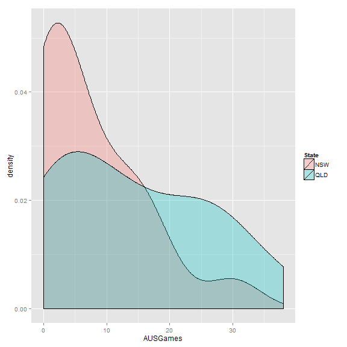
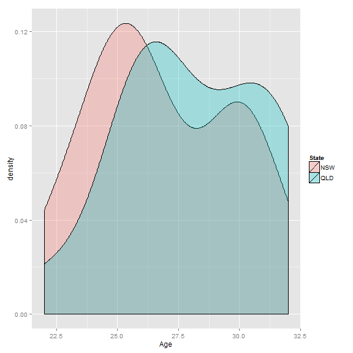

Can we predict the outcome of the State of Origin Series just by looking at the Number of Australian representitive players on each Team?
========================================================

The State of Origin is a 3 game series held annually between NSW and Queensland. It is generally considered to be the highest standard games of Rugby League as it pits the best Australian players against each other. Australia dominates International Rugby League (though they do on occasion lose) and its probable that the NSW or QLD side would still be favourites against any other international side.

The Game itself is usually very close and given the quality of the teams, come backs from even deep deficiets are common. Despite this, the Queensland team has managed to rattle off 8 series victories in a row!

Despite this, every year there are headlines in the NSW papers about how the Blues can win. This post will look at the predictive abilities of a model based on the number of Origin players who are in the Australian team in each squad (one of the conditions of Origin selection is that the player must be eligable for selection to the Australian squad)

 

We can also look at the number of former Australian players in each team:

 

This appears about even, but its deceptive as we can see from the number of caps per player

 

One area where they have a bit of an advantage is in the age of the team

 
