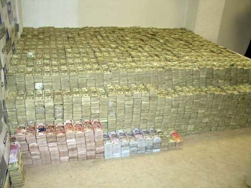

Recently I joined up in some friends to compete in a share trading game run by the Australian Stock Exchange (ASX). They have changed the structure of the game somewhat since the last time we played, removing the ability to buy indexes or commodities listed on the stock market. Instead all you can do is buy 298 of the ASX300 (the largest companies listed). Even short selling is not possible. Instead of going down the usual path of buying shares in things I know, or doing research I think it would be fun to try and use analytics to pick the stocks. I have no illusion this would work (except by chance), but it would be fun to beat my friends who largely work in finance.

For this analysis I will use two separate approaches:

1. In the excellent book "An introduction to Statistical Learning" by James, Witten, Hastie & Tibshirani they have a part of chapter 4 devoted to building a classification model for daily share movements. Surprisingly the model actually goes quite well at about ~60% accuracy (remembering that 50% would be chance). Lets see if these models do equally well on the ASX data.

2. Earlier in the year the excellent machine learning blog FastML (well worth subscribing too) had an interesting [post](http://fastml.com/are-stocks-predictable/) on [Forecastable Component Analysis](http://arxiv.org/abs/1205.4591) by Georg M. Georg. Georg has actually created a [CRAN package](http://cran.r-project.org/web/packages/ForeCA/index.html) for the approach which will we try and use.

So we need Data, lots of data


### Start with the index

Often we want to start off simply and increase the complexity from there. So lets begin by getting the data for the ASX300 index and try our techniques on that. Then when the pipeline is working we can move to the actual stocks.

Lets load up our libraries:

```{r, message=FALSE, cache=TRUE, cache.path = 'Churn_cache/', fig.path='figure/'}
library(plyr)
library(dplyr)
library(reshape2)
library(stringr)
library(ggplot2)
library(caret)
```

Sadly it does not seem easy to get lots of data on the ASX300 index (though the individual stocks don't seem to be a problem). 

Lets load the data we can get and have a look.

```{r, message=FALSE, cache=TRUE, cache.path = 'Churn_cache/', fig.path='figure/'}
asx300<-read.csv("asx300.csv", header=T)
asx300$Date<-as.Date(asx300$Date, format = "%d/%m/%Y")
ggplot(asx300, aes(x=Date, y=Adj.Close)) + geom_line() + scale_x_date()
ggplot(asx300, aes(x=Date, y=Return)) + geom_line() + scale_x_date()
```

Lets start super simple and see how we go with just the excellent [forecast package](http://cran.r-project.org/web/packages/forecast/index.html) which is built for time series.

```{r, message=FALSE, cache.path = 'Churn_cache/', fig.path='figure/'}
library(forecast)
basic.model<-forecast(asx300$Adj.Close[301:21], h=20)
plot(basic.model)
lines(asx300$Adj.Close[301:1])

```

This is not a terrible prediction, but we can see that it is naive (just guessing the last price) and symmetrical. So really this will not help us to become rich.





So lets move onto the ForeCA package.

```{r, message=FALSE, cache.path = 'Churn_cache/', fig.path='figure/'}
library(ForeCA)
Omega(asx300$Return)

```

7% out of a 100! Though this does seem to imply that there is something that is predictable as 0% means totally random.

Lets take the next step and fire up the foreca process but we will break up the asx300 into smaller chunks for it based on different industries.


References:
1. A [talk](http://techtalks.tv/talks/forecastable-component-analysis/58229/) on Forecast Component Analysis by Georg Georg.
2. 
